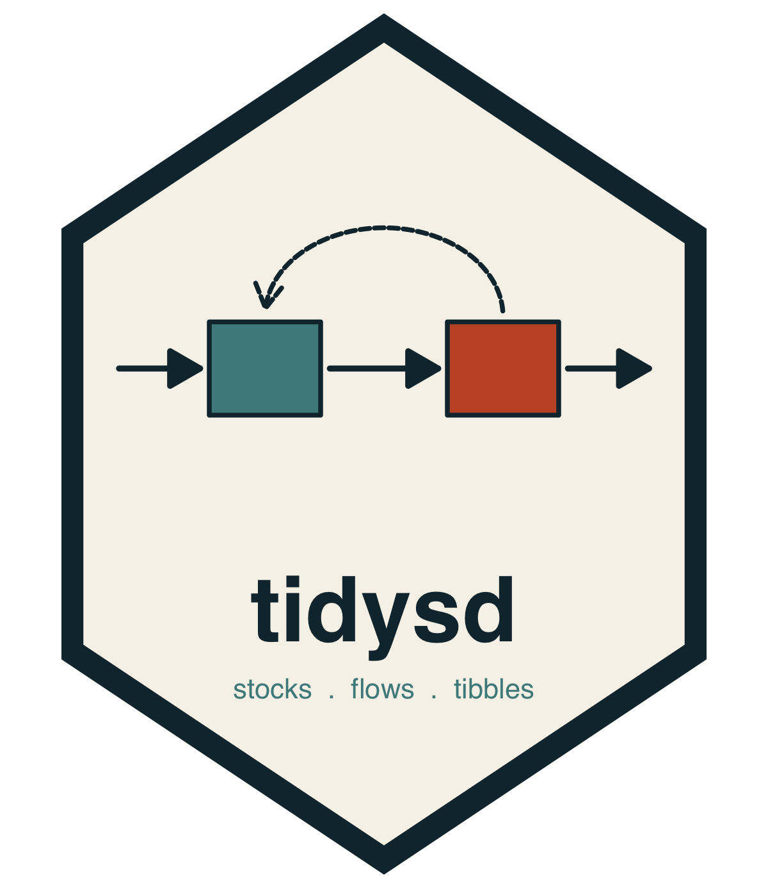

```{r, include = FALSE}
knitr::opts_chunk$set(
  collapse = TRUE,
  comment = "#>",
  fig.path = "man/figures/README-",
  out.width = "100%",
  dpi = 150,
  fig.width = 8,
  fig.height = 4.5
)
```

# tidysd 

<!-- badges: start -->
[](https://github.com/rayhanalirachman/tidySD/actions/workflows/R-CMD-check.yaml)
[](https://lifecycle.r-lib.org/articles/stages.html#experimental)
<!-- badges: end -->

**A tidy grammar for system dynamics modelling in R.**

Specify a stock-and-flow model as **three independent layers**, and simulate it
with one verb.

```
sd_structure()    what exists, how it is wired      (no math)
sd_equations()    functional forms                  (symbolic)
sd_parameters()   the numbers and data

simulate(structure, equations, parameters, spec = sim_spec())
    -> binds, validates, integrates, returns one long tibble
```

There is no compile step. Binding and validation happen inside `simulate()`;
the "model" is just the three layer objects.

## Installation

```r
# install.packages("remotes")
remotes::install_github("rayhanalirachman/tidySD")
```

`tidysd::simulate()` deliberately masks `stats::simulate()` -- the grammar's
one verb takes the three layers, not a fitted model. `sd_simulate()` is an
identical, non-masking alias if you would rather not shadow it.

## A model in three layers

```{r sir}
library(tidysd)

sir_struct <- sd_structure(
  meta(name = "SIR"),
  stock("S", units = "people", non_negative = TRUE),
  stock("I", units = "people", non_negative = TRUE),
  stock("R", units = "people", non_negative = TRUE),
  aux("beta",   units = "1/(people*day)"),
  aux("lambda", units = "1/day"),
  flow("IR", from = "S", to = "I", units = "people/day"),
  flow("RR", from = "I", to = "R", units = "people/day")
)

sir_eqns <- sd_equations(
  beta   ~ contact_rate * infectivity / total_population,
  lambda ~ beta * I,
  IR     ~ S * lambda,
  RR     ~ I / recovery_time
)

sir_pars <- sd_parameters(
  constant(contact_rate = 6, infectivity = 0.20,
           total_population = 1000, recovery_time = 5),
  initial(S = 999, I = 1, R = 0)
)

spec <- sim_spec(start = 0, stop = 100, dt = 0.125,
                 method = "euler", time_unit = "day")

out <- simulate(sir_struct, sir_eqns, sir_pars, spec = spec)
out
```

Output is one long tibble, so plotting comes free:

```{r sir-plot}
autoplot(out)
```

Because the layers are independent, swapping the transmission form touches the
equations and nothing else:

```{r swap}
sir_dd <- update(sir_eqns, lambda ~ contact_rate * infectivity * I)
```

## Design principles

- **Readable** — a model reads as a specification, not a build script.
- **Layered** — swap or reuse any one layer without touching the others.
- **Tidy output** — one long-format tibble per run; `ggplot2` methods come free.
- **No hidden state** — layers are immutable; a variant is a new object.
- **Diagrams from the model** — `sd_diagram()` reads the wiring out of the model
  rather than asking you to draw it.
- **Domain vocabulary** — `stock()`, `flow()`, `aux()`; never matrix builders.
- **Order-independent** — equations resolve to a dependency graph at run time.

## What each layer holds

| Item | Structure | Equations | Parameters |
|---|:--:|:--:|:--:|
| Stock / flow / aux / lookup / input exists; its units | x | | |
| Flow `from` / `to` wiring | x | | |
| Flow-rate and auxiliary formulas | | x | |
| Choice of functional form | | x | |
| Derived initial-value form (`init(S) ~ pop - I0`) | | x | |
| Constant and stock-initial values | | | x |
| Lookup point data; input series / driver function | | | x |
| `dt`, method, `start`, `stop` | \- `sim_spec()` \- | | |

## Built-ins on an equation right-hand side

Delays and smoothing — `delayN()`, `smoothN()`, the pipeline delay
`delay_fixed()`, and `forecast()`. Shaping functions `step()`, `pulse()`,
`ramp()`. Also `previous()`, `t`, `dt`, and base-R maths (`ifelse`, `min`,
`max`, `sqrt`, `sin`, `exp`, `log`, `%*%`, `sum`, ...).

## Scenarios, data and calibration

```{r scenarios, eval = FALSE}
# many runs, one call
simulate(struct, eqns, pars, spec = spec,
         scenarios = scenarios(base = list(),
                               aggressive = list(fraction_reinvested = 0.14)))

# an exogenous driver read from a data frame
sd_parameters(input_series("emissions", data = global_emissions, interp = "linear"))

# observed data carried through to the output, tagged source = "observed"
simulate(struct, eqns, pars, spec = spec, observed = cases, map = c(I = "count"))

# least-squares estimation of free constants
calibrate(struct, eqns, pars, spec = spec, observed = cases,
          target = c(I = "count"), free = c("beta", "infectious_period"),
          lower = c(beta = 0, infectious_period = 1),
          upper = c(beta = 0.01, infectious_period = 5))
```

## The catalogue

Twenty-two worked models ship with the package, each exercising a different
corner of the grammar. Run any of them by number or name:

```{r catalogue}
sd_example_ids()
out <- sd_example_run("lotka_volterra")
```

They cover exponential and logistic growth, overshoot and collapse, Solow
growth, SIR (aggregate, cohort-subscripted and fitted to real data), Bass
diffusion, material and pipeline delays, information smoothing at every order,
trend forecasting, a workforce aging chain, manufacturing defects, an
atmospheric carbon bathtub driven from a data series, the Roessler attractor, a
pendulum, sales-agent motivation and the capability trap.

Every one of them is verified in the test suite against an independently
hand-coded integration of the original model.

## Prior art

[seminr](https://github.com/sem-in-r/seminr) -- the layered constructor-DSL this
design follows -- and [deSolve](https://cran.r-project.org/package=deSolve), the
raw ODE substrate. Nearby in spirit: **sdbuildR** (pipe-chain builder),
**readsdr** (XMILE import), **PySD** and **BPTK-Py** in Python,
**StockFlow.jl** in Julia, **sfcr** for stock-flow-consistent macro models, and
**XMILE**, the interchange standard behind every GUI tool.

## Acknowledgements

The catalogue models are reimplementations of published teaching models:
Jim Duggan's [SDMR](https://github.com/JimDuggan/SDMR) (MIT (c) 2016 Jim
Duggan), the [SDXorg/test-models](https://github.com/SDXorg/test-models)
conformance corpus, and the
[SDXorg/PySD-Cookbook](https://github.com/SDXorg/PySD-Cookbook) samples
((c) 2014-2022 James Houghton and Eneko Martin-Martinez). Only the equations are
reproduced, as reference; the tidysd versions are rewritten in this grammar.
