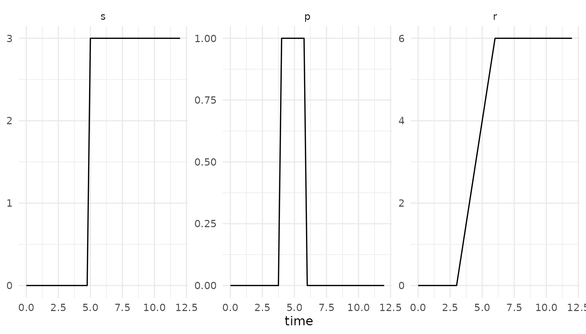
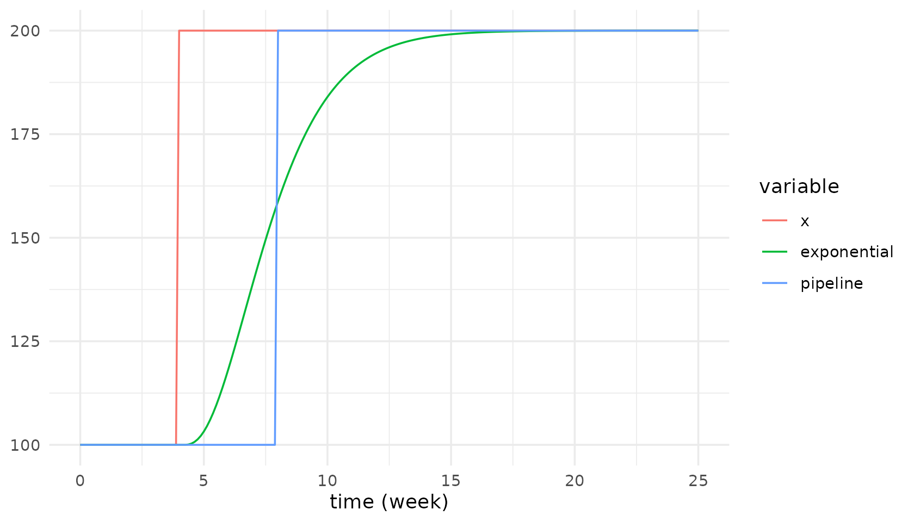
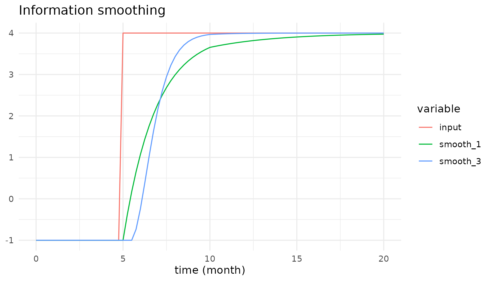
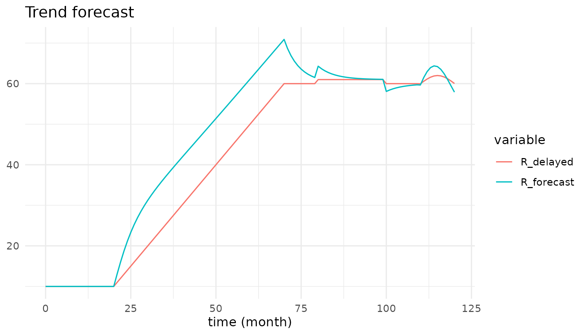

# Delays, smoothing and shaping functions

``` r

library(tidysd)
#> 
#> Attaching package: 'tidysd'
#> The following object is masked from 'package:stats':
#> 
#>     simulate
```

## Shaping functions

[`step()`](https://rdrr.io/r/stats/step.html), `pulse()` and `ramp()`
follow Vensim’s argument order. They read the current time themselves,
so you never write `t` unless you want to.

``` r

shapes <- sd_structure(aux("s"), aux("p"), aux("r"))
out <- simulate(
  shapes,
  sd_equations(s ~ step(3, 5), p ~ pulse(4, 2), r ~ ramp(2, 3, 6)),
  sd_parameters(),
  spec = sim_spec(0, 12, 0.25)
)
autoplot(out)
```



- `step(height, time)` – 0 before `time`, `height` from `time` on.
- `pulse(start, width)` – 1 during `[start, start + width)`, else 0. The
  height multiplies on, so it stays a parameter rather than an argument.
- `ramp(slope, start, end)` – 0, then a linear rise, then held flat.

The height of a [`step()`](https://rdrr.io/r/stats/step.html) may itself
be an expression of time, which is how the `forecast` catalogue model
drives a sine wave in after month 100.

## First-order delays: by hand, or as a built-in

A first-order material delay is just a stock whose outflow is the stock
over a delay time. You can write that yourself:

``` r

hand <- simulate(
  sd_structure(
    stock("Material", units = "units", non_negative = TRUE),
    flow("inflow",  from = .source,    to = "Material", units = "units/week"),
    flow("outflow", from = "Material", to = .sink,      units = "units/week")),
  sd_equations(inflow ~ 100 + step(100, 4), outflow ~ Material / delay_time),
  sd_parameters(constant(delay_time = 4), initial(Material = 400)),
  spec = sim_spec(0, 25, 0.125, time_unit = "week")
)
```

Or let `delayN()` build the same structure for you, without adding
buffer stocks by hand:

``` r

builtin <- simulate(
  sd_structure(aux("inflow"), aux("outflow")),
  sd_equations(inflow ~ 100 + step(100, 4),
               outflow ~ delayN(inflow, 4, initial = 100)),
  sd_parameters(),
  spec = sim_spec(0, 25, 0.125, time_unit = "week")
)

all.equal(
  out_hand <- subset(as.data.frame(hand), variable == "outflow")$value,
  subset(as.data.frame(builtin), variable == "outflow")$value
)
#> [1] TRUE
```

`delayN(x, delay, order, initial)` is an *exponential* delay: a cascade
of `order` stocks, each holding `delay / order` of the transit time.
`initial` is the delay’s **output** at `t = start` – the same third
argument Vensim’s `DELAY N` takes – and defaults to `x` there. `order`
is read once, at initialisation.

## Exponential versus pipeline

`delay_fixed()` is a conveyor, not a cascade: whatever goes in comes out
unchanged, exactly `delay` later. Side by side on the same step input,
that is the clearest statement of the difference.

``` r

cmp <- simulate(
  sd_structure(aux("x"), aux("exponential"), aux("pipeline")),
  sd_equations(
    x           ~ 100 + step(100, 4),
    exponential ~ delayN(x, 4, order = 3, initial = 100),
    pipeline    ~ delay_fixed(x, 4, initial = 100)),
  sd_parameters(),
  spec = sim_spec(0, 25, 0.125, time_unit = "week")
)
autoplot(cmp, vars = c("x", "exponential", "pipeline"), facet = "none") +
  ggplot2::aes(colour = variable)
```



Delay times that are not whole multiples of `dt` round to the nearest
step, and the delay may itself be a variable.

## Smoothing at any order

Vensim’s five spellings – `SMOOTH`, `SMOOTHI`, `SMOOTH3`, `SMOOTH3I`,
`SMOOTH N` – collapse into one built-in with two optional arguments.

``` r

out <- sd_example_run("smooth")
autoplot(out, vars = c("input", "smooth_1", "smooth_3"), facet = "none") +
  ggplot2::aes(colour = variable)
```



Here the input steps from -1 to 4 at month 5 *and* the adjustment time
steps from 2 to 4 at month 10, so the smooths chase a moving target
through a moving time constant. Higher order lags more early and catches
up harder later.

Because `order` is fixed at initialisation,
`smoothN(input, adjustment_time, order = 2 + step(1, 10))` stays
second-order for the whole run – which is exactly what the Vensim
reference output shows.

## Forecasting

`forecast(x, average_time, horizon)` is sugar, not new semantics: it is
exactly

    x * (1 + horizon * (x - smoothN(x, average_time)) / (smoothN(x, average_time) * average_time))

Smooth the input, read the growth rate implied by the gap between the
input and its own smooth, and project it forward. It is deliberately
naive, and overshoots turning points – which is the point.

``` r

out <- sd_example_run("forecast")
autoplot(out, vars = c("R_delayed", "R_forecast"), facet = "none") +
  ggplot2::aes(colour = variable)
```



## An aux-only model

When a delay or smooth carries all the state, a model needs no
hand-declared stocks at all – the smooth *is* the stock. The internal
stages never appear in the output.

``` r

sd_variables(sd_example("smooth")$structure)
#> # A tibble: 7 × 6
#>   name            type  units dims  from  to   
#>   <chr>           <chr> <chr> <chr> <chr> <chr>
#> 1 input           aux   NA    NA    NA    NA   
#> 2 adjustment_time aux   NA    NA    NA    NA   
#> 3 smooth_1        aux   NA    NA    NA    NA   
#> 4 smooth_1i       aux   NA    NA    NA    NA   
#> 5 smooth_3        aux   NA    NA    NA    NA   
#> 6 smooth_3i       aux   NA    NA    NA    NA   
#> 7 smooth_n        aux   NA    NA    NA    NA
unique(sd_example_run("smooth")$variable)
#> [1] "input"           "adjustment_time" "smooth_1"        "smooth_1i"      
#> [5] "smooth_3"        "smooth_3i"       "smooth_n"
```
