# The catalogue

``` r

library(tidysd)
```

Twenty-two worked models ship with the package. Each one exercises a
different corner of the grammar, and each is verified in the test suite
against an independently hand-coded integration of the original.

``` r

sd_example_ids()
#> # A tibble: 23 × 2
#>    number name           
#>     <int> <chr>          
#>  1      1 customer_growth
#>  2      2 s_shaped_growth
#>  3      3 overshoot      
#>  4      4 solow          
#>  5      5 sir            
#>  6      6 bass           
#>  7      7 cohort_sir     
#>  8      8 material_delay 
#>  9      9 teacup         
#> 10     10 lotka_volterra 
#> # ℹ 13 more rows
```

Run any of them by number or by name.
[`sd_example()`](https://rayhanalirachman.github.io/tidySD/reference/sd_example.md)
hands back the three layers and the spec, so you can read, edit or
re-parameterise any of them before running:

``` r

ex <- sd_example("sir")
ex
#> <sd_example 5: sir>
#>   SIR
#> <sim_spec> 0 -> 100, dt = 0.125, euler (day)
#>   3 stocks, 4 equations
ex$equations
#> <sd_equations> 4 equations
#>   beta ~ contact_rate * infectivity/total_population
#>   lambda ~ beta * I
#>   IR ~ S * lambda
#>   RR ~ I/recovery_time
out <- sd_example_run("sir")
```

Models 1-8 follow Jim Duggan’s [SDMR](https://github.com/JimDuggan/SDMR)
code (MIT (c) 2016 Jim Duggan); 9-15 the
[SDXorg/test-models](https://github.com/SDXorg/test-models) conformance
corpus; 16-21 the
[SDXorg/PySD-Cookbook](https://github.com/SDXorg/PySD-Cookbook) samples
((c) 2014-2022 James Houghton and Eneko Martin-Martinez). The tidysd
versions are reimplementations in this grammar, not translations of
code.

## 1. Customer / population growth

Single stock, one inflow and one outflow, each a constant fraction of
the stock – the canonical first-order feedback loop, exponential growth.
From Duggan’s SDMR chapter 2.

``` r

out <- sd_example_run("customer_growth")
autoplot(out, vars = c("Customers", "recruits", "losses"))
```

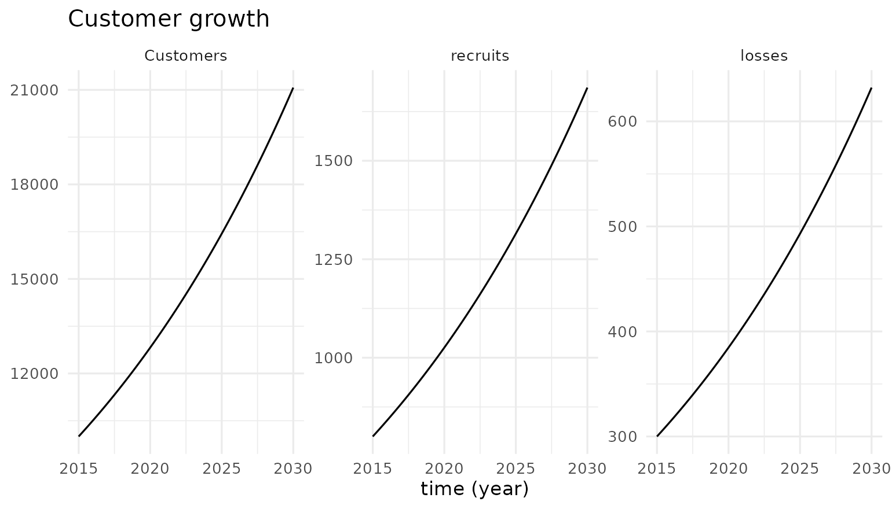

## 2. S-shaped growth (logistic)

A fractional growth rate scaled by an “effect of availability” that
falls linearly to zero as the stock fills its carrying capacity.
Reinforcing loop dominant early, balancing loop dominant late.

``` r

out <- sd_example_run("s_shaped_growth")
autoplot(out, vars = c("Stock", "net_flow", "growth_rate"))
```

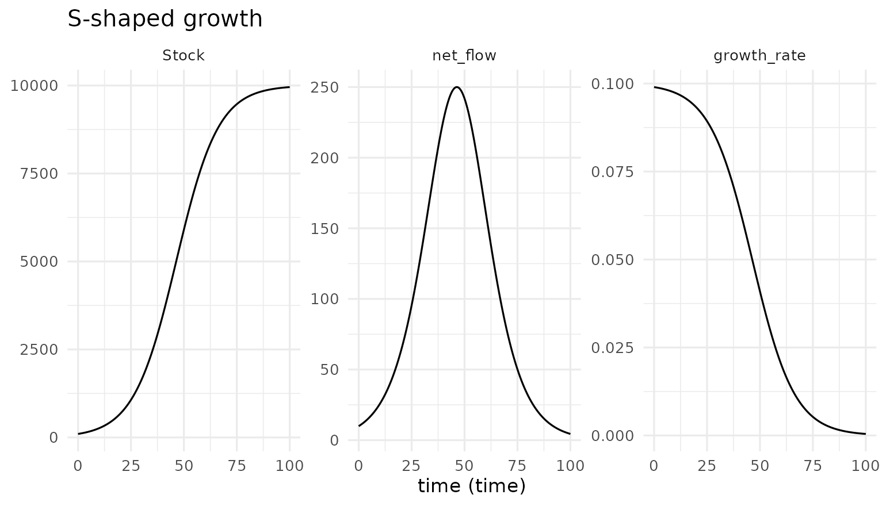

## 3. Overshoot and collapse

`Capital` reinvests a fraction of its profit; `Resource` is a finite
pool that only drains. Extraction efficiency is a graphical function of
the remaining resource – flat while abundant, collapsing as it depletes.
Five scenarios on the reinvestment fraction and desired growth.

``` r

out <- sd_example_run("overshoot")
autoplot(out, vars = c("Capital", "Resource"))
```

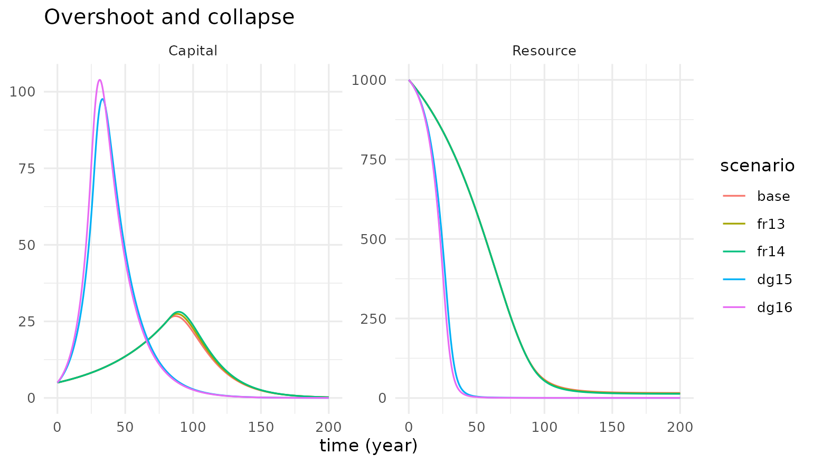

## 4. Solow economic growth

Output is concave in capital (`labour * sqrt(Machines)`); a fixed
fraction is reinvested, capital depreciates linearly. Converges to the
steady state where investment equals depreciation – here exactly 40,000
machines.

``` r

out <- sd_example_run("solow")
autoplot(out, vars = c("Machines", "investment", "discards"))
```

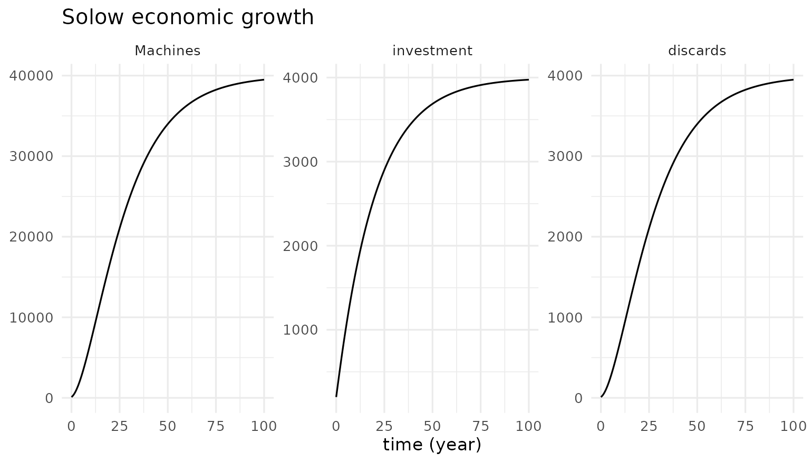

## 5. SIR

Three stocks, two flows, frequency-dependent transmission and a constant
recovery rate. The grammar’s reference case.

``` r

out <- sd_example_run("sir")
autoplot(out, vars = c("S", "I", "R", "IR", "RR"))
```

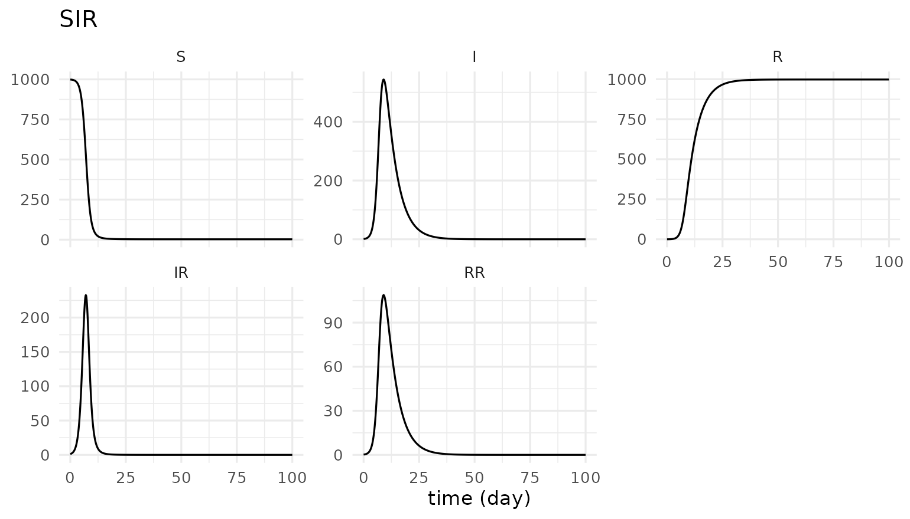

## 6. Bass diffusion

Adoption driven by word of mouth only. S-shaped cumulative adoption,
bell-shaped adoption rate.

``` r

out <- sd_example_run("bass")
autoplot(out, vars = c("PotentialAdopters", "Adopters", "adoption_rate"))
```

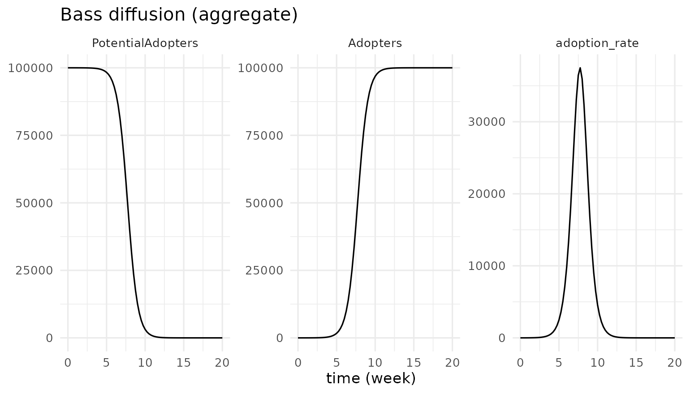

## 7. Cohort SIR

The population split into three cohorts, each with its own S/I/R,
coupled by a 3x3 contact matrix. The force of infection is a
matrix-vector product; one `S -> I -> R` chain declared once over a
`cohort` dimension.

``` r

out <- sd_example_run("cohort_sir")
autoplot(out, vars = "I")
```

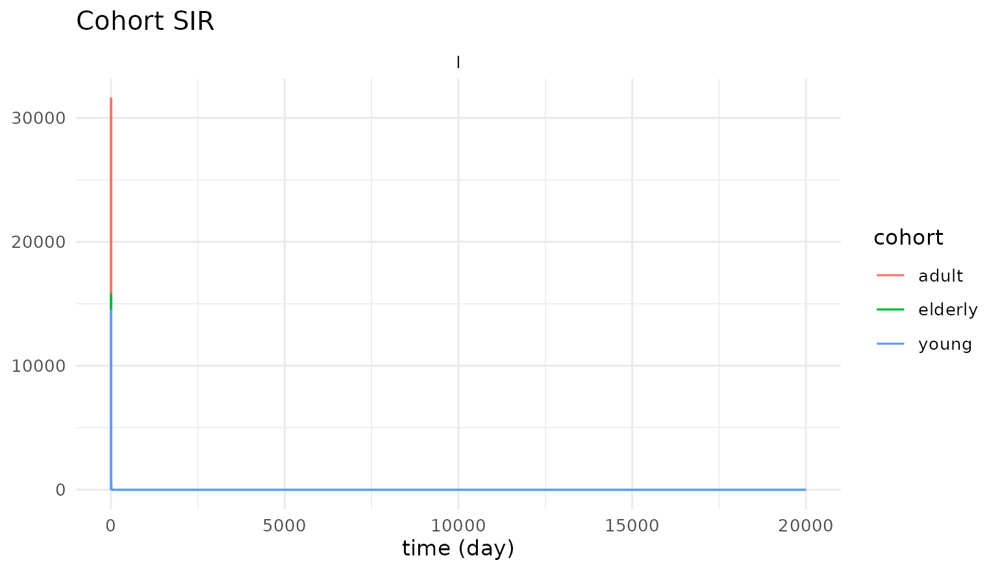

## 8. Material delay

A step increase in the inflow, an outflow equal to the stock over a
fixed delay time. The outflow lags the inflow and approaches it
exponentially.

``` r

out <- sd_example_run("material_delay")
autoplot(out, vars = c("Material", "inflow", "outflow"))
```

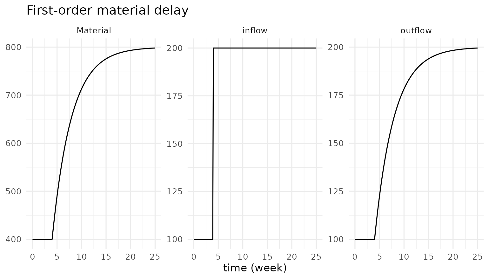

## 9. Teacup cooling

The smallest complete stock-and-flow model there is: one stock, one
outflow proportional to the gap between the stock and a constant goal.

``` r

out <- sd_example_run("teacup")
autoplot(out, vars = c("TeacupTemperature", "heat_loss_to_room"))
```

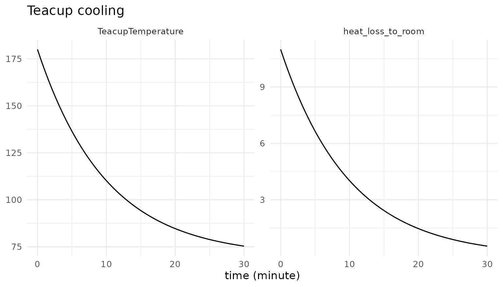

## 10. Lotka-Volterra

Two stocks with reciprocal nonlinear coupling. The file asks for Euler
at `dt = 0.0625`, which inflates the peaks and drives prey to numerical
zero – kept as shipped.

``` r

out <- sd_example_run("lotka_volterra")
autoplot(out, vars = c("Prey", "Predators"))
```

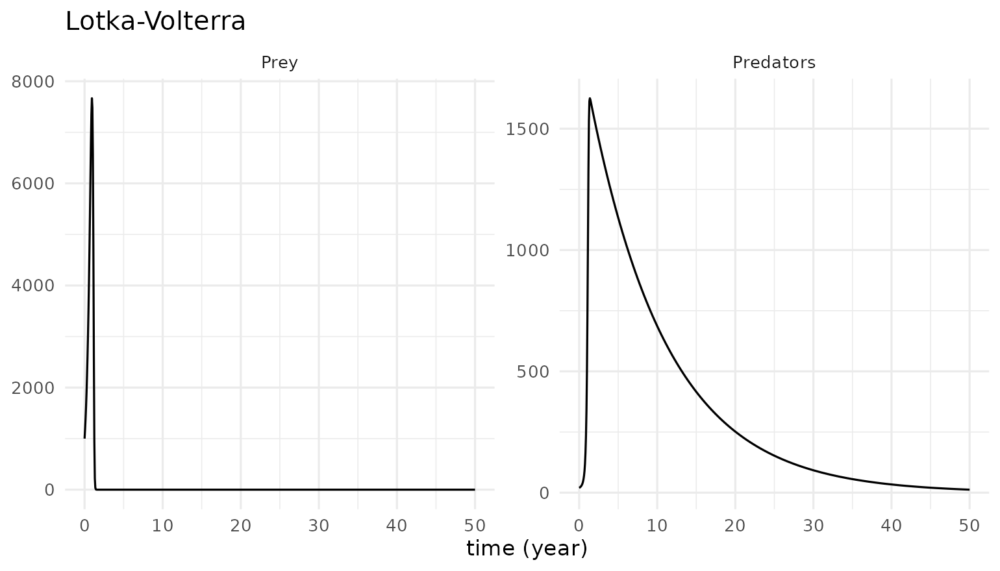

## 11. Town population with an aged outflow

One `Population` stock replicated over 351 towns. Deaths are the birth
flow pushed through an eighth-order delay of one lifespan – an aging
chain written as one `delayN()`.

``` r

out <- sd_example_run("town_population")
d <- as.data.frame(out)
d <- d[d$variable == "Population" & d$town %in% c("Town001", "Town010", "Town100"), ]
ggplot2::ggplot(d, ggplot2::aes(time, value, colour = town)) +
  ggplot2::geom_line() + ggplot2::scale_y_log10() +
  ggplot2::labs(y = "people (log scale)", x = "month") + ggplot2::theme_minimal()
```

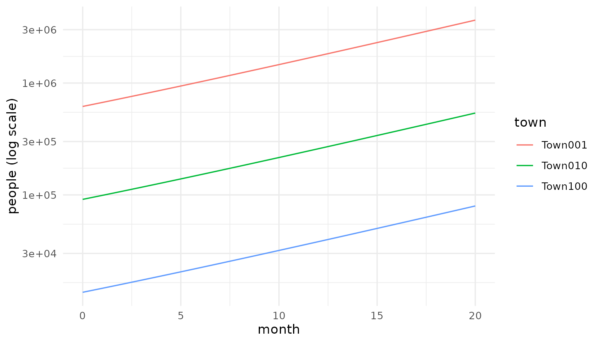

## 12. SMOOTH

A pure information-delay model: no stocks declared by hand, because
every smooth *is* the stock. The input steps at month 5 and the
adjustment time itself steps at month 10.

``` r

out <- sd_example_run("smooth")
autoplot(out, vars = c("input", "smooth_1", "smooth_3", "smooth_n"))
```

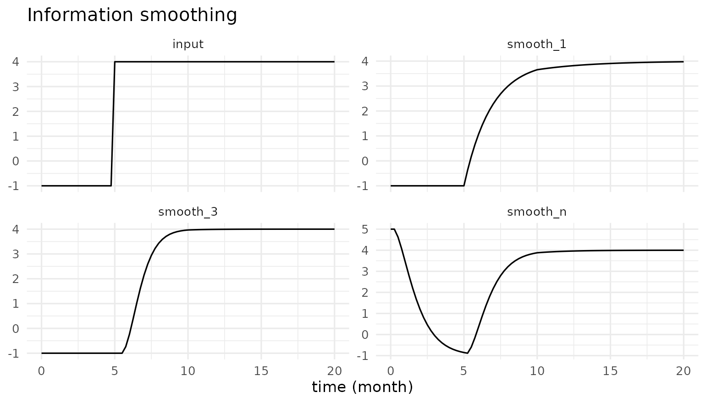

## 13. FORECAST

Smooth the input, read the growth rate implied by the gap between input
and smooth, project it forward. Deliberately naive: it overshoots
turning points.

``` r

out <- sd_example_run("forecast")
autoplot(out, vars = c("R", "R_delayed", "R_forecast"))
```

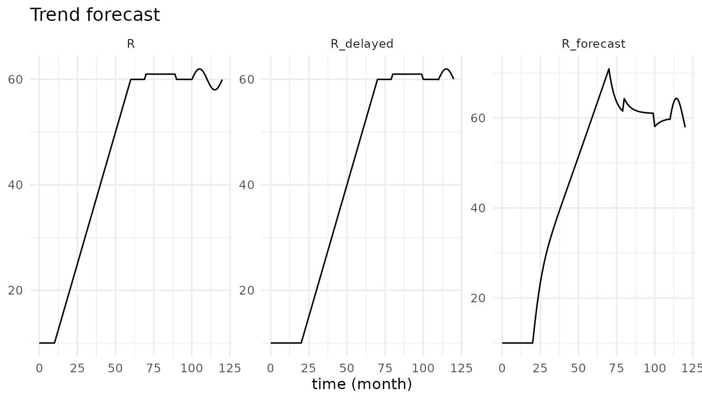

## 14. Fixed (pipeline) delay

`Time^2` driven through eight fixed delays at `dt = 1`. Whatever goes in
comes out unchanged, exactly `delay` later; delay times round to the
nearest step, and the delay may itself be a variable.

``` r

out <- sd_example_run("delay_fixed")
autoplot(out, vars = c("time_squared", "DF1", "DF2", "DF37", "DT2"))
```

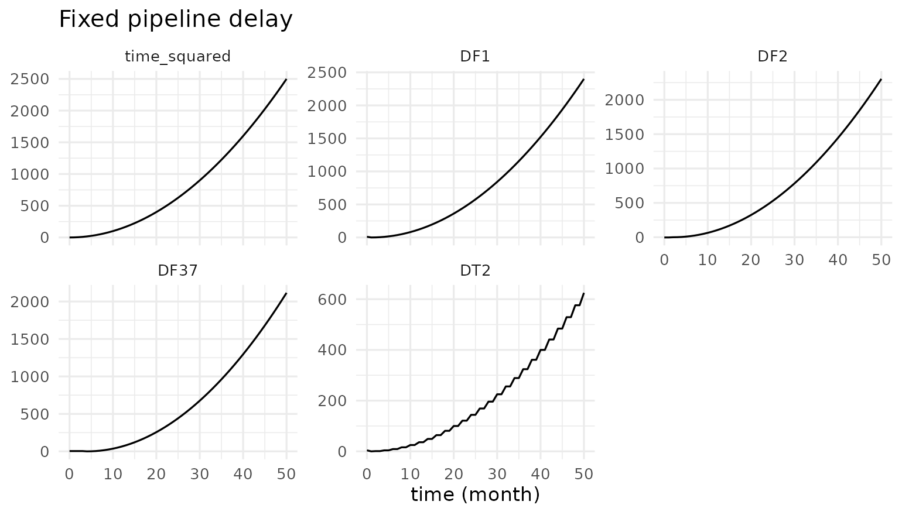

## 15. Workforce and task backlog

An aging chain of rookies maturing into experts, and a backlog they work
off. Rookies consume expert supervision, so hiring in response to a
backlog makes the backlog worse before it gets better.

``` r

out <- sd_example_run("workforce")
autoplot(out, vars = c("Rookies", "Experts", "TaskBacklog"))
```

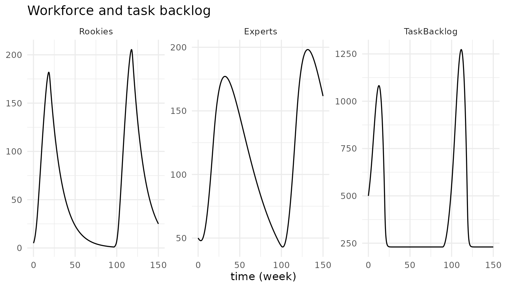

## 16. Manufacturing defects

Two graphical functions of one backlog that both push the wrong way: a
bigger backlog makes people work faster *and* longer, and the defect
rate is the ratio of the two.

``` r

out <- sd_example_run("defects")
autoplot(out, vars = c("Backlog", "defect_rate", "arrival_rate"))
```

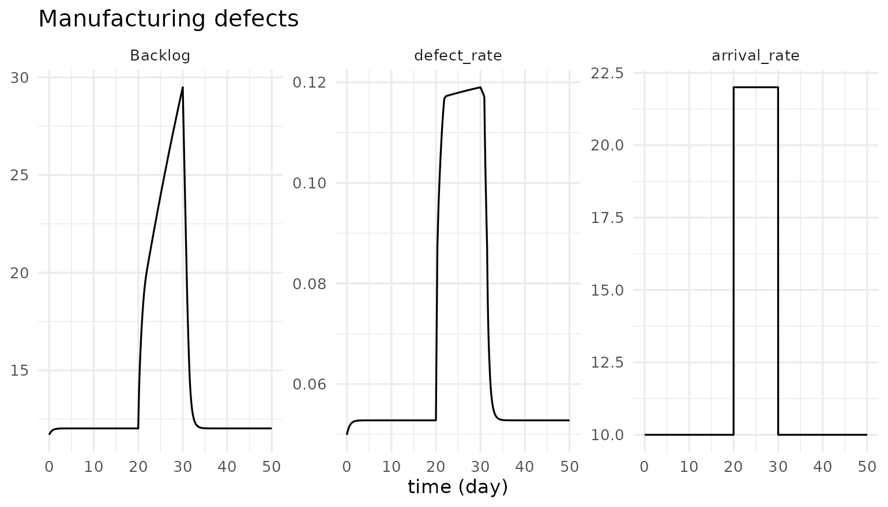

## 17. Atmospheric carbon bathtub

The smallest possible climate model, and the example of driving a model
from a file. With emissions rising and removal proportional to the
stock, the stock cannot stabilise.

``` r

out <- sd_example_run("carbon_bathtub")
autoplot(out, vars = c("ExcessAtmosphericCarbon", "emission_flow", "natural_removal"))
```

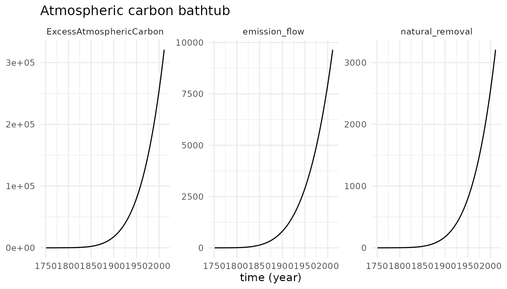

## 18. Roessler attractor

Three stocks, no lookups – the minimum structure that produces
deterministic chaos. Each flow is a signed net rate. This is the entry
where `method` matters: Euler at the same `dt` is not accurate enough.

``` r

out <- sd_example_run("roessler")
autoplot(out, x = "x", y = "y")
```

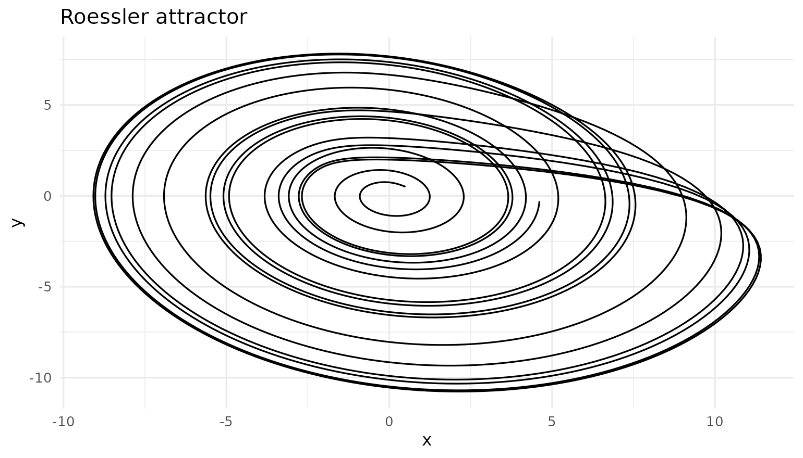

## 19. Single pendulum

A second-order mechanical system written the SD way: two stocks in a
chain, where the flow into position *is* the other stock. Undamped, so
RK4 conserves energy and Euler pumps it in.

``` r

out <- sd_example_run("pendulum")
autoplot(out, vars = c("AngularPosition", "AngularVelocity"))
```

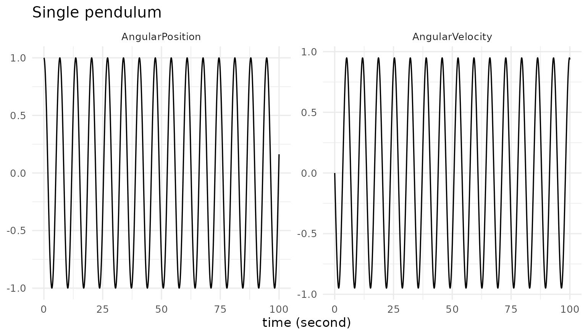

## 20. Sales agent motivation

Motivation is a stock adjusting toward income; income depends on sales,
sales on effort, effort on motivation through a sharply convex graphical
function. A start-up subsidy holds the loop up; when it ends, the loop
reverses.

``` r

out <- sd_example_run("sales_agents")
autoplot(out, vars = c("Motivation", "Tenure"))
```

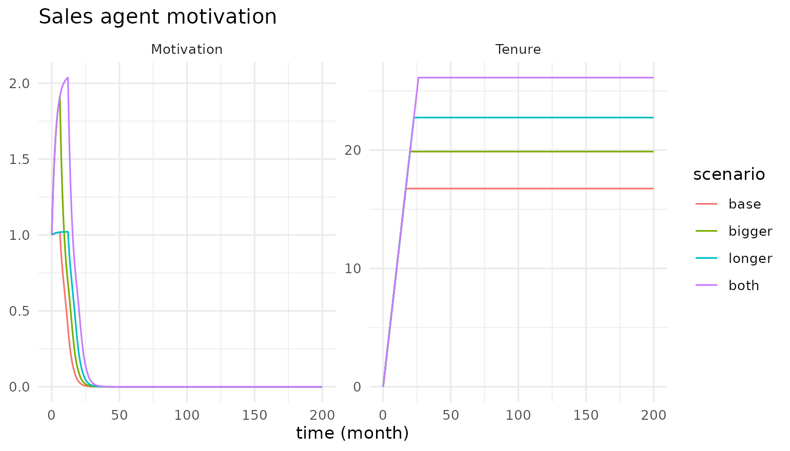

## 21. Capability trap

Repenning and Sterman’s archetype. Pressure to do work buys output now
but shortens improvement time, so the fast loop starves the slow one. At
the shipped defaults the model sits in exact equilibrium; a small
pressure step decides which way it goes.

``` r

out <- sd_example_run("capability_trap")
autoplot(out, vars = c("Capability", "actual_performance"))
```

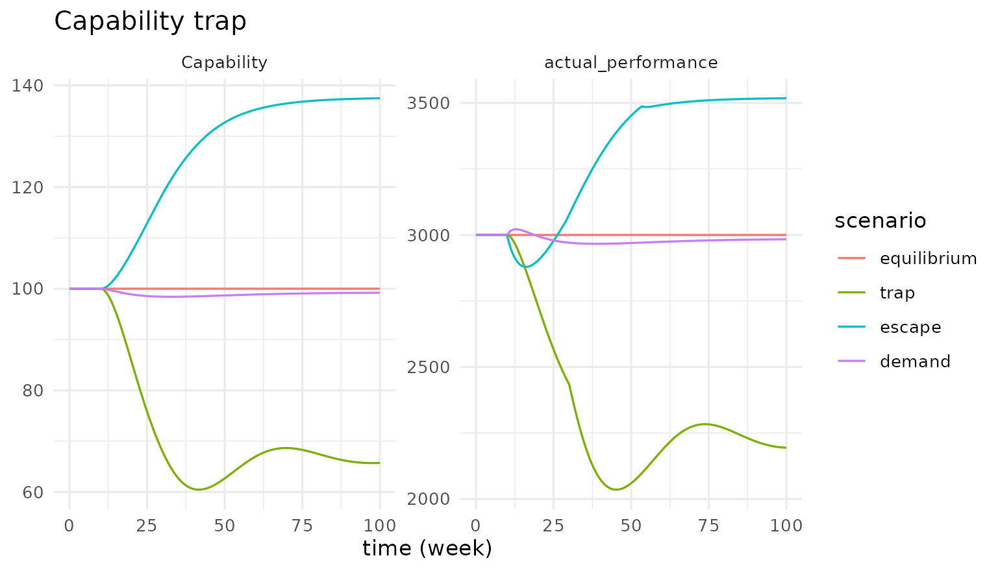

## 22. Boarding-school flu – SIR fitted to real data

The 1978 English boarding-school influenza outbreak: 763 boys, one index
case, daily counts of boys confined to bed over about two weeks. An SIR
model with mass-action transmission is fitted to those counts with
[`calibrate()`](https://rayhanalirachman.github.io/tidySD/reference/calibrate.md).

``` r

ex <- sd_example("boarding_school_flu")
fit <- calibrate(ex$structure, ex$equations, ex$parameters, spec = ex$spec,
                 observed = ex$observed, target = ex$calibration$target,
                 free = ex$calibration$free,
                 lower = ex$calibration$lower, upper = ex$calibration$upper)
fit
#> <sd_calibration>
#>   estimated:
#>     beta                         0.00218772
#>     infectious_period            2.25504
#>   SSE          4121.92 over 15 observations
#>   convergence  0 (converged)

out <- simulate(ex$structure, ex$equations, fit$parameters, spec = ex$spec,
                observed = ex$observed, map = ex$map)
autoplot(out, vars = "I")
```

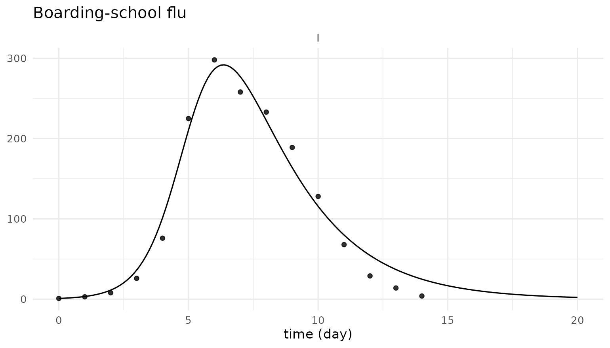

## Diagrams come from the model

The stock-and-flow and causal-loop diagrams are functions of the model,
not drawings you maintain alongside it.

``` r

ex <- sd_example("sir")
d <- sd_diagram(ex$structure, ex$equations, ex$parameters, type = "sfd")
d$edges
#> # A tibble: 13 × 4
#>    from             to     kind        sign 
#>    <chr>            <chr>  <chr>       <chr>
#>  1 S                IR     outflow     NA   
#>  2 IR               I      inflow      NA   
#>  3 I                RR     outflow     NA   
#>  4 RR               R      inflow      NA   
#>  5 contact_rate     beta   information +    
#>  6 infectivity      beta   information +    
#>  7 total_population beta   information -    
#>  8 beta             lambda information +    
#>  9 I                lambda information +    
#> 10 S                IR     information +    
#> 11 lambda           IR     information +    
#> 12 I                RR     information +    
#> 13 recovery_time    RR     information -
autoplot(d)
```

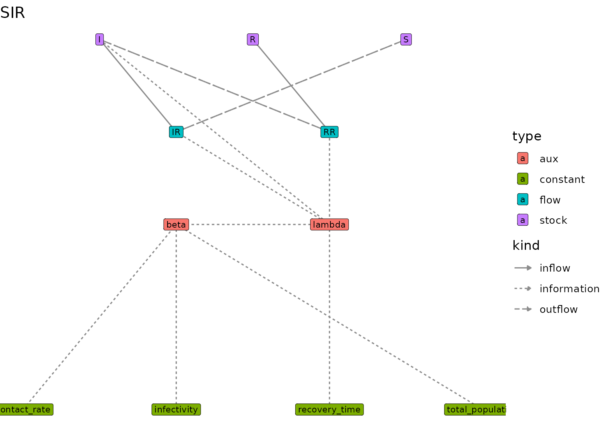
