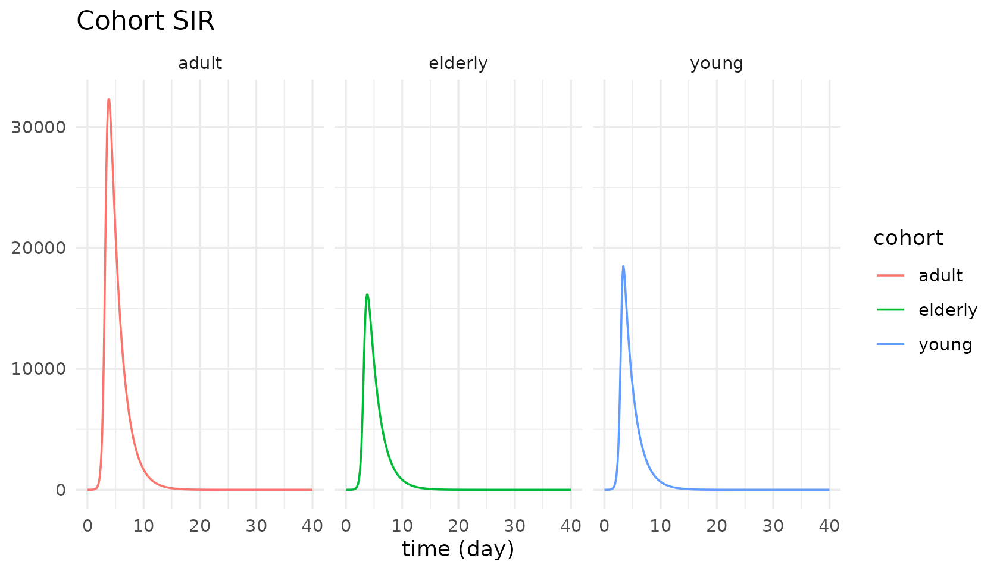

# Subscripted models

``` r

library(tidysd)
#> 
#> Attaching package: 'tidysd'
#> The following object is masked from 'package:stats':
#> 
#>     simulate
```

## One chain, declared once

A subscript is a named dimension. Declare it with
[`subscripts()`](https://rayhanalirachman.github.io/tidySD/reference/subscripts.md),
give a variable `dims =`, and write each equation once – element-wise,
as ordinary R arithmetic.

Duggan’s disaggregated SIR splits a population into three cohorts, each
with its own S/I/R, coupled through a 3x3 contact matrix.

``` r

coh_struct <- sd_structure(
  meta(name = "Cohort SIR"),
  subscripts(cohort = c("young", "adult", "elderly")),

  stock("S", dims = "cohort", units = "people", non_negative = TRUE),
  stock("I", dims = "cohort", units = "people", non_negative = TRUE),
  stock("R", dims = "cohort", units = "people", non_negative = TRUE),

  aux("lambda",         dims = "cohort", units = "1/day"),
  aux("total_infected",                  units = "people"),

  flow("IR", from = "S", to = "I", dims = "cohort", units = "people/day"),
  flow("RR", from = "I", to = "R", dims = "cohort", units = "people/day")
)

coh_eqns <- sd_equations(
  lambda         ~ (CE %*% I) / pop,   # CE is cohort x cohort; %*% contracts against I
  IR             ~ lambda * S,         # element-wise over cohort
  RR             ~ I / recovery_time,
  total_infected ~ sum(I)              # reduce the cohort dim -> scalar
)
```

The force of infection is a matrix-vector product; the transitions are
element-wise; the total is a reduction. Nothing else in the model text
knows there is more than one cohort.

## Constants can be vectors and matrices

``` r

coh_pars <- sd_parameters(
  constant(
    CE = matrix(c(3, 2, 1,
                  2, 2, 1,
                  1, 1, 0.5), nrow = 3, byrow = TRUE),
    pop = c(young = 25000, adult = 50000, elderly = 25000),
    recovery_time = 2                     # a scalar broadcasts over the dimension
  ),
  initial(
    S = c(young = 24999, adult = 50000, elderly = 25000),
    I = c(young = 1,     adult = 0,     elderly = 0),
    R = 0                                 # so does a scalar initial
  )
)

out <- simulate(coh_struct, coh_eqns, coh_pars,
                spec = sim_spec(0, 40, 0.125, time_unit = "day"))
```

## A subscript is just another column

The payoff of tidy output: the dimension comes back as a column, so
faceting is ordinary `ggplot2`.

``` r

autoplot(out, vars = "I") + ggplot2::facet_wrap(~cohort)
```



Reductions are scalars, so their subscript column is `NA`:

``` r

subset(as.data.frame(out), variable == "total_infected" & time %in% c(0, 4, 40),
       select = c(cohort, time, variable, value))
#>      cohort time       variable        value
#> 5779   <NA>    0 total_infected 1.000000e+00
#> 5811   <NA>    4 total_infected 6.184651e+04
#> 6099   <NA>   40 total_infected 6.098787e-04
```

## The dimension can be large

Nothing about the model text changes when the dimension grows. The town
population model replicates one `Population` stock over 351 members, and
pushes births through an eighth-order delay of one lifespan – an aging
chain written as one `delayN()` rather than eight hand-built cohort
stocks.

``` r

ex <- sd_example("town_population")
ex$equations
#> <sd_equations> 2 equations
#>   births ~ birthrate * Population
#>   deaths ~ delayN(births, lifespan, order = 8, initial = Population/lifespan)

out <- sd_example_run("town_population")
d <- as.data.frame(out)
tot <- tapply(d$value[d$variable == "Population"], d$time[d$variable == "Population"], sum)
round(tot[c("0", "5", "10", "20")])
#>        0        5       10       20 
#>  6547704  9974080 15492293 38690983
```

## How other tools write the same sum

Two families. The **index** family adds a named dimension and uses a
reduction operator for `Lambda[c] = sum_j beta[c,j] * I[j]`:

| Tool               | how that sum is written                            |
|--------------------|----------------------------------------------------|
| Vensim             | `SUM(beta[cohort, cohort2!] * Infected[cohort2!])` |
| Stella / iThink    | `SUM(beta[Cohort, *] * Infected[*])`               |
| PySD (xarray)      | `(beta * Infected).sum("cohort2")`                 |
| ModelingToolkit.jl | `CE * I`                                           |
| **tidysd**         | `(CE %*% I) / pop`                                 |

The **composition** family (StockFlow.jl) never writes an index at all:
build the base SIR and a small model of the age structure, then
stratify. `tidysd` sits with the index family, with the payoff that a
subscript is just another column in the output tibble.
