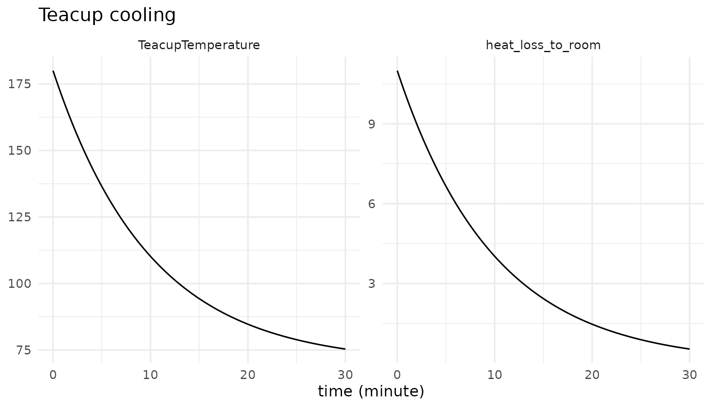
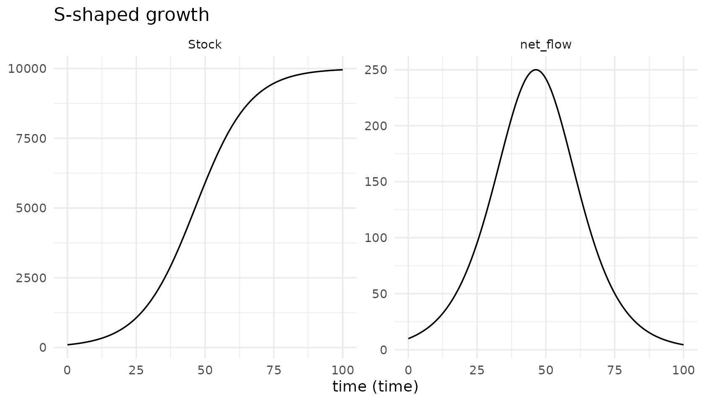

# Getting started with tidysd

``` r

library(tidysd)
#> 
#> Attaching package: 'tidysd'
#> The following object is masked from 'package:stats':
#> 
#>     simulate
```

## Three layers, one verb

A `tidysd` model is not an object you build up; it is three plain,
immutable values that only meet inside
[`simulate()`](https://rayhanalirachman.github.io/tidySD/reference/simulate.md).

    sd_structure()    what exists, how it is wired      (no math)
    sd_equations()    functional forms                  (symbolic)
    sd_parameters()   the numbers and data

The split is not cosmetic. It is what lets you keep a structure and swap
the functional form, or keep both and swap every number, without editing
a line of the other two.

## The smallest complete model

One stock, one outflow proportional to the gap between the stock and a
goal: a cup of tea cooling toward room temperature.

``` r

teacup_struct <- sd_structure(
  meta(name = "Teacup cooling"),
  stock("TeacupTemperature", units = "degF"),
  flow("heat_loss_to_room", from = "TeacupTemperature", to = .sink,
       units = "degF/minute")
)

teacup_eqns <- sd_equations(
  heat_loss_to_room ~ (TeacupTemperature - room_temperature) / characteristic_time
)

teacup_pars <- sd_parameters(
  constant(room_temperature = 70, characteristic_time = 10),
  initial(TeacupTemperature = 180)
)

out <- simulate(teacup_struct, teacup_eqns, teacup_pars,
                spec = sim_spec(start = 0, stop = 30, dt = 0.125,
                                method = "euler", time_unit = "minute"))
out
#> # Teacup cooling
#> # A tibble: 482 × 5
#>     time variable          value unit  type 
#>    <dbl> <chr>             <dbl> <chr> <chr>
#>  1 0     TeacupTemperature  180  degF  stock
#>  2 0.125 TeacupTemperature  179. degF  stock
#>  3 0.25  TeacupTemperature  177. degF  stock
#>  4 0.375 TeacupTemperature  176. degF  stock
#>  5 0.5   TeacupTemperature  175. degF  stock
#>  6 0.625 TeacupTemperature  173. degF  stock
#>  7 0.75  TeacupTemperature  172. degF  stock
#>  8 0.875 TeacupTemperature  171. degF  stock
#>  9 1     TeacupTemperature  169. degF  stock
#> 10 1.12  TeacupTemperature  168. degF  stock
#> # ℹ 472 more rows
```

Every run returns one long tibble: `time`, `variable`, `value`, `unit`,
`type`, plus a column per subscript dimension and, when you ask for
them, `scenario` and `source`. That is the whole output contract, so
`ggplot2` comes free.

``` r

autoplot(out)
```



## What goes in which layer

| Item | Structure | Equations | Parameters |
|:---|:--:|:--:|:--:|
| Stock / flow / aux / lookup / input exists; units | x |  |  |
| Flow `from` / `to` wiring | x |  |  |
| Flow-rate and auxiliary formulas |  | x |  |
| Choice of functional form |  | x |  |
| Derived initial-value form (`init(S) ~ pop - I0`) |  | x |  |
| Constant and stock-initial values |  |  | x |
| Lookup point data; input series |  |  | x |

Each stock’s initial value comes from exactly one place: a number in
[`initial()`](https://rayhanalirachman.github.io/tidySD/reference/initial.md),
or a formula via
[`init()`](https://rayhanalirachman.github.io/tidySD/reference/init.md)
in the equations. Asking for both is an error, and so is asking for
neither.

Numeric literals *are* allowed on an equation right-hand side. A
`1 - x/K` or an `ifelse` threshold is structure, not a parameter.

## Order does not matter

Equations resolve into a dependency graph when the model is bound, so
you can write them in whatever order reads best.

``` r

struct <- sd_structure(
  meta(name = "S-shaped growth"),
  stock("Stock", units = "widgets", non_negative = TRUE),
  aux("availability"), aux("effect"), aux("growth_rate"),
  flow("net_flow", from = .source, to = "Stock", units = "widgets/time")
)

# written back to front on purpose
eqns <- sd_equations(
  net_flow     ~ Stock * growth_rate,
  growth_rate  ~ ref_growth_rate * effect,
  effect       ~ availability / ref_availability,
  availability ~ 1 - Stock / capacity
)

pars <- sd_parameters(
  constant(capacity = 10000, ref_growth_rate = 0.10),
  reference(ref_availability = 1),
  initial(Stock = 100)
)

out <- simulate(struct, eqns, pars,
                spec = sim_spec(0, 100, 0.25, time_unit = "time",
                                check_units = FALSE))
autoplot(out, vars = c("Stock", "net_flow"))
```



A genuinely simultaneous loop is reported as one, with the cycle that
caused it, rather than silently resolved.

## Immutability, and variants

Layers never change in place.
[`update()`](https://rdrr.io/r/stats/update.html) returns a new object,
which is how you write a variant.

``` r

sir <- sd_example("sir")

# frequency-dependent transmission, as shipped ...
deparse(sir$equations$eqns$lambda$rhs)
#> [1] "beta * I"

# ... swapped for density-dependent, structure and parameters untouched
dd <- update(sir$equations, lambda ~ contact_rate * infectivity * I)
deparse(dd$eqns$lambda$rhs)
#> [1] "contact_rate * infectivity * I"

# and the original is exactly as it was
deparse(sir$equations$eqns$lambda$rhs)
#> [1] "beta * I"
```

The same applies to parameters:

``` r

faster <- update(sir$parameters, constant(recovery_time = 2))
sir$parameters$constants$recovery_time
#> [1] 5
faster$constants$recovery_time
#> [1] 2
```

## Checking a model without running it

[`sd_validate()`](https://rayhanalirachman.github.io/tidySD/reference/sd_validate.md)
does exactly the binding and validation that
[`simulate()`](https://rayhanalirachman.github.io/tidySD/reference/simulate.md)
does, and hands back the bound model.

``` r

bound <- sd_validate(sir$structure, sir$equations, sir$parameters, sir$spec)
bound
#> <sd_bound> SIR 
#>   stocks        S, I, R 
#>   eval order    beta, lambda, IR, RR
```

## Units

Units are declared in the structure layer and nowhere else. Constants
carry none, so the only check the grammar can honestly make is the
structural one: a flow’s units must be the units of the stock it moves,
per unit of simulation time. Everything unspecified is simply not
checked.

``` r

bad <- sd_structure(
  stock("Population", units = "people"),
  flow("births", from = .source, to = "Population", units = "people")  # missing /year
)
tryCatch(tidysd:::check_flow_units(bad, "year"), warning = conditionMessage)
#> [1] "Unit mismatch: flow 'births' is declared 'people'.\n\033[31m✖\033[39m Stock 'Population' is 'people', so the flow should be 'people/year' (per year)."
```

## Where to go next

- [`vignette("builtins")`](https://rayhanalirachman.github.io/tidySD/articles/builtins.md)
  – delays, smoothing, and shaping functions.
- [`vignette("subscripts")`](https://rayhanalirachman.github.io/tidySD/articles/subscripts.md)
  – arrayed models over named dimensions.
- [`vignette("data")`](https://rayhanalirachman.github.io/tidySD/articles/data.md)
  – exogenous drivers, observed series and
  [`calibrate()`](https://rayhanalirachman.github.io/tidySD/reference/calibrate.md).
- [`vignette("catalogue")`](https://rayhanalirachman.github.io/tidySD/articles/catalogue.md)
  – all twenty-two worked models.
